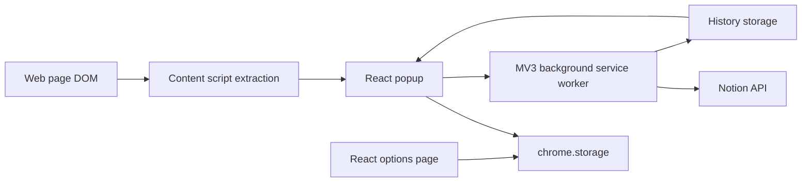

# ClipMate v0.5 Project Architecture

Last updated: 2026-06-17.

## Product Shape

ClipMate is a Chrome and Edge Manifest V3 extension that extracts web content, lets the user edit tags/notes/Markdown in a popup, and saves the result to Notion. Version `v0.5` focuses on article image preservation by sending external image URLs to Notion, without downloading, uploading, caching, OCR, or screenshots.

## Repository Map

- `clipmate-v0.5/`: active version and source of truth for current development.
- `clipmate-v0.1/` to `clipmate-v0.4/`: frozen historical versions.
- `other source/`: reference plugin code for comparison.
- `测试文档/`: test notes and artifacts from previous work.
- `docs/`: project-level Codex migration, architecture, and memory docs.
- `.agents/skills/clipmate-codex-workflow/`: repo-scoped Codex skill for future ClipMate work.
- `.codex/config.toml`: project-scoped Codex config with conservative defaults.

## Tech Stack

- Vite + React 18 + TypeScript.
- `@crxjs/vite-plugin` for extension build integration.
- Manifest V3 service worker background.
- Content scripts for extraction and page analysis.
- Chrome extension storage for settings, draft, history, and Notion targets.
- Notion REST API for appending blocks.
- Vitest for unit and integration-style tests.

## Runtime Topology

## Main Entry Points

- `clipmate-v0.5/manifest.config.ts`: extension manifest, popup/options entry points, background worker, content script, permissions, and Notion host permission.
- `clipmate-v0.5/src/background/index.ts`: runtime message dispatch; currently handles `SAVE_TO_NOTION`.
- `clipmate-v0.5/src/background/handlers/notionHandler.ts`: validates payloads, builds Notion blocks, appends to Notion, and writes success/failure history.
- `clipmate-v0.5/src/content/index.ts`: full-page extraction, selection extraction, comment-context extraction, low-confidence fallback, and image metadata attachment.
- `clipmate-v0.5/src/content/parser/htmlToMarkdown.ts`: HTML to Markdown conversion, image Markdown preservation, formulas, tables, links, and cleanup.
- `clipmate-v0.5/src/content/extractors/articleImages.ts`: article image discovery, URL resolution, noise filtering, and metadata counts.
- `clipmate-v0.5/src/platforms/notion/blocks.ts`: Markdown to Notion block conversion, including external image block fallback.
- `clipmate-v0.5/src/platforms/notion/client.ts`: Notion request batching and error-code mapping.
- `clipmate-v0.5/src/shared/storage/storage.ts`: settings, targets, draft, and history persistence.
- `clipmate-v0.5/src/popup/App.tsx`: popup workflow, extraction mode, preview/original tabs, copy/save actions, and draft persistence.
- `clipmate-v0.5/src/options/App.tsx`: settings and history UI.

## Core Data Flows

Full-page clipping:

1. Popup asks the active tab content script for extraction.
2. Content script clones and cleans the document.
3. Readability and project heuristics identify article content.
4. Markdown is generated and image metadata is attached.
5. Popup stores draft changes and optionally saves through the background worker.

Selection clipping:

1. Popup tries selection extraction first.
2. If selection is unavailable, popup falls back to full-page extraction or a same-URL draft.
3. Comment-context mode can wrap selected/comment context for social and discussion pages.

Notion saving:

1. Popup sends `SAVE_TO_NOTION` to the background worker.
2. Background validates token, target, and content.
3. Markdown becomes Notion blocks.
4. Blocks are appended in batches.
5. History is written or updated with status and lightweight image metadata.

Image handling in v0.5:

1. Content extraction resolves article image URLs relative to the page.
2. No binary image content is stored or uploaded.
3. Markdown image syntax is preserved for suitable images.
4. Notion image blocks are used for direct external image URLs.
5. Unsupported or risky image URLs fall back to paragraph text.
6. Image block failures should not block body text saving.

## Durable v0.5 Decisions

- Keep image support URL-only.
- Do not add image download/upload/cache/OCR/screenshot behavior in v0.5.
- Keep extraction pure where possible: no network, storage, or Chrome API dependency in image extraction helpers.
- Store only lightweight history metadata: `imageCount`, `firstImageUrl`, and `skippedImageCount`.
- Use safety filters for icons, avatars, tracking pixels, placeholders, and obvious UI noise.
- Avoid saving whole-document pollution; prefer article/content fragments.

## Known Watch List

- Manifest/docs drift: v0.5 decisions mention existing `scripting` permission, but current `manifest.config.ts` does not include it.
- `searchHistory()` searches title, URL, and tags, while the UI local filter also searches target name, note, content, and Markdown. Decide whether this API should be broadened or documented as narrower.
- `htmlToMarkdown()` uses module-level `imagePageUrl` for Turndown image URL resolution. It works in current single-call use, but it is a reentrancy smell.
- History retry reconstructs a draft from stored formatted Markdown; review whether metadata/header Markdown can be duplicated on retry.
- `notionRichText` uses simple regex parsing and may not handle nested or escaped Markdown.
- `articleImages.getBestSrc()` is narrower than the Turndown image rule because it does not inspect lazy attributes such as `data-src` and `data-original`.
- Options page status timers should be reviewed for cleanup if that component gets more complex.
- Real Notion QA is still important for cross-origin external images and broken external image URLs.

## Quality Bar

Before calling a future version complete:

- Lint must pass.
- Test suite must pass.
- Build must pass.
- Browser QA should cover popup, options, full-page clipping, selection clipping, copy Markdown, save to Notion, history, retry, and representative article image pages.
- Docs should record what changed, what was tested, and which issues remain.
